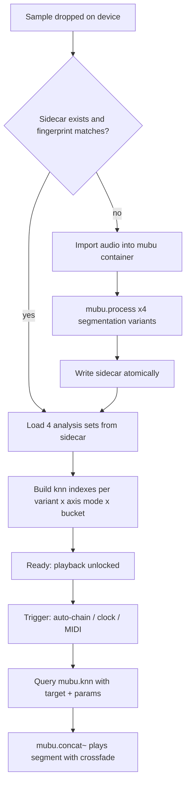

# Coagula — M4L Concatenative Device Spec

Sep 25, 2026 · @Jaycee Lydian

## Overview

A Max for Live instrument that loads one long sample (target: \~1 hour), precomputes four segmentations plus a full descriptor set, then plays back by descriptor-space retrieval under live modulation. Working name "Coagula" is a placeholder.

**Goals**

- Load a sample once; all heavy work happens at load, never during playback.
- Every playback-time switch (descriptor axis, segmentation variant, texture/assembly, silence) is instant — no re-analysis.
- Default behavior is *reassembled*: syllables and notes stay intact, reordered wrong but coherently.
- Analysis persists in a sidecar keyed to the sample file, reusable across Live Sets.

**Non-goals (v1)**

- Live-performance CPU budgeting. Target is a desktop with 64 GB RAM.
- Seamless morphing *between* segmentation variants. Switching is a hard cut by design.
- Multi-sample corpora. One sample per device instance.
- Global/offline sequence optimization (DP, beam search). Retrieval is per-grain.

**Target material:** speech and solo saxophone — pitched, largely monophonic, single-source. Descriptor defaults are tuned for this; the flatness axis exists for noisier material.

## Architecture

Two phases, strictly separated: a blocking **load phase** that does all analysis, and a real-time **playback phase** that only queries and plays.



**Container layout (preferred):** one `mubu` container holding a single audio track plus four sets of marker + descriptor tracks, one set per segmentation variant. Audio is stored once.

**Container layout (fallback):** four `mubu` containers, each with its own audio copy. Costs \~4x audio RAM (see Memory budget); acceptable at 64 GB. Use only if concat/knn cannot address per-variant tracks inside one container.

**Memory budget (1 hr source):**

| Item | Size (approx) |
| --- | --- |
| Audio, stereo, 32-bit float @ 44.1 kHz | \~1.27 GB |
| Audio, mono analysis copy (if needed) | \~0.64 GB |
| Descriptors, 4 variants, \~8 columns, up to \~72k segments each | < 20 MB |
| Fallback layout extra audio copies (x3) | \~3.8 GB |

Correction from earlier estimate: MuBu stores float samples, so \~1.27 GB, not \~600 MB.

## Analysis pipeline

One frame-level descriptor pass over the audio, then four segmentations, then per-segment statistics. All of it runs in `mubu.process` at load; nothing here runs during playback.

**Frame analysis (shared across variants)**

- Analyze a mono sum; play back from the original channels.
- Frame 2048 samples, hop 256 (\~5.8 ms at 44.1 kHz). Scale hop with sample rate.
- Pitch floor 50 Hz, ceiling \~1.5 kHz (covers low male speech through alto/soprano sax fundamentals).

**Segmentation variants**

| Variant | Segmenter | Max segment | Role |
| --- | --- | --- | --- |
| `onset` | Onset detection | None | Purest assembly; sustains stay whole |
| `hybrid_400` | Onset, sustains split at 400 ms | 400 ms | **Default.** Assembly with bounded grain length |
| `hybrid_200` | Onset, sustains split at 200 ms | 200 ms | Texture-leaning |
| `fixed` | Fixed chop, 100 ms | 100 ms | Texture baseline, ignores content |

Minimum segment length 30 ms across all variants; shorter onset fragments merge into the previous segment.

**Per-segment descriptor columns (identical schema in every variant)**

| Column | Unit | Aggregation over frames | Notes |
| --- | --- | --- | --- |
| `pitch` | MIDI note (float) | Median of voiced frames only | Hz converted to MIDI for perceptual spacing |
| `voicing` | 0–1 | Mean periodicity | Drives voiced/unvoiced split |
| `centroid` | MIDI-scale (log Hz) | Mean | Log so bright and dark are evenly spaced |
| `flatness` | 0–1 | Mean | Only used by the flatness axis mode |
| `loudness` | dB | Mean and max (two columns) | Mean drives silence bucketing |
| `duration` | ms | — | From markers |
| `src_pos` | ms | Segment start | Used by the continuity parameter |
| `voiced` | 0/1 | Derived | 1 if voicing ≥ 0.5 and pitch valid |

Segments with `voiced = 0` get `pitch` set to a sentinel, never a tracker garbage value. They are excluded from pitch-axis queries (see Retrieval).

**Analysis parameters are part of the cache key.** Frame size, hop, onset threshold, split lengths, and pitch range all go into the sidecar manifest; changing any of them invalidates the cache. These are set in an advanced panel, not exposed to automation.

## Persistence

Analysis lives in a sidecar folder next to the sample, keyed to the sample file, reusable across every Live Set that loads it. The Live Set stores only the sample path.

**Layout**

```
myHour.wav
myHour.wav.coagula/
  manifest.json
  onset.<ext>
  hybrid_400.<ext>
  hybrid_200.<ext>
  fixed.<ext>
```

`<ext>` is whatever format MuBu writes descriptor and marker tracks to natively (see Verify-before-build). No audio in the sidecar.

**Manifest contents**

- Schema version (device-side; bump on any column or format change).
- Source fingerprint: file size, modification time, sample rate, channel count, frame count, plus a hash of a few fixed-position audio blocks (start, middle, end). Cheap, and catches re-exports that keep size and mtime.
- Full analysis parameter set (from Analysis pipeline).
- Per-variant segment count, written last.

**Load logic**

1. Sample dropped or Live Set opened → read manifest if present.
2. Valid if schema, fingerprint, and analysis params all match, and all four variant files exist with the recorded segment counts.
3. Valid → load variants, build indexes, unlock playback.
4. Invalid or missing → analyze, write sidecar, then load.

**Write rules**

- Atomic: write to a temp folder beside the sample, then rename over the old one. A crash mid-write never leaves a half-valid cache.
- Manifest written last inside the temp folder, so a missing manifest always means "incomplete".
- Sample folder not writable (read-only volume, sample library) → fall back to a device cache directory keyed by fingerprint hash. Status line says which location is in use.
- Never delete a sidecar automatically. Invalidation overwrites; it does not clean up.

**Live Set state:** absolute sample path, plus the selected variant/mode parameters as normal automatable parameters. Missing sample on open → error state (see Edge cases), device keeps its parameters.

## Retrieval and playback

The device is an M4L **Instrument**: MIDI in, stereo out. Each trigger runs one selection decision, then `mubu.concat~` plays the chosen segment with a crossfade.

**Buckets (per variant)**

| Bucket | Membership | Queried on |
| --- | --- | --- |
| Silence | `loudness` mean < silence threshold | Nothing — random pick, weighted toward durations near the last played segment |
| Unvoiced | Non-silent, `voiced = 0` | `centroid` only |
| Voiced | Non-silent, `voiced = 1` | Active axis mode |

Changing the silence threshold re-partitions buckets and rebuilds that variant's indexes off the audio thread, debounced \~100 ms. The old index serves queries until the new one swaps in. No re-analysis.

**Axis modes**

| Mode | X | Y | Default for |
| --- | --- | --- | --- |
| Pitch | `pitch` | `centroid` | Speech, sax |
| Noise | `flatness` | `centroid` | Dense or noisy sources |

In Noise mode the voiced/unvoiced split collapses: all non-silent segments form one index. Each axis is scaled to the variant's own min–max range, so a target of 0–1 always spans the actual coagula.

**Selection order per trigger**

1. **Silence roll** — probability = Silence density → pick from Silence bucket.
2. **Continuity roll** — probability = Continuity → play the segment that follows the last one in source order (next `src_pos`). Skipped if that segment is in the Silence bucket and Silence density is 0.
3. **Unvoiced roll** (Pitch mode only) — probability = Unvoiced mix → nearest-by-centroid from Unvoiced bucket.
4. **Main query** — target (X, Y) plus Jitter offset → k nearest in the active index → pick one uniformly.
5. **Repeat guard** — exclude the last N played segments from steps 3–4 (default N = 4). Without it, k = 1 on a static target loops one grain forever.

**Trigger modes**

- **Chain** (assembly default): next trigger fires at current segment end minus crossfade. Runs while a MIDI note is held or the Run toggle is on. Monophonic apart from the crossfade overlap.
- **Clock** (texture default): fixed rate in Hz or synced to Live transport divisions. Polyphonic, voice cap 32.
- **MIDI**: each note-on triggers one segment. Velocity → gain.

**Key tracking (Pitch mode):** when on, the MIDI note replaces the X target with an absolute pitch instead of a normalized one. Nearest available pitch wins; no transposition unless Transpose-to-match is on, which resamples the segment by the pitch difference (clamped to ±12 semitones).

**Variant switching mid-playback:** the playing segment finishes untouched. The next query uses the new variant. Continuity carries over by finding the segment in the new variant that contains the last played `src_pos`.

## Parameters

Every parameter below is a Live parameter: automatable, MIDI-mappable, saved with the Set. Analysis parameters are not in this list; they live in the advanced panel and invalidate the cache.

**Playback parameters**

| Parameter | Range | Default | Notes |
| --- | --- | --- | --- |
| Variant | onset / hybrid\_400 / hybrid\_200 / fixed | hybrid\_400 | Hard cut between variants |
| Axis mode | Pitch / Noise | Pitch |  |
| Target X | 0–1 | 0.5 | Pitch or flatness, normalized to coagula |
| Target Y | 0–1 | 0.5 | Centroid, normalized to coagula |
| k | 1–32 | 1 | Morph-bundled |
| Jitter | 0–0.5 (fraction of axis range) | 0 | Morph-bundled |
| Crossfade | 2–200 ms | 8 ms | Morph-bundled; clamped to half the segment length |
| Continuity | 0–1 | 0.6 | Morph-bundled |
| Max length | 20 ms – off | off | Morph-bundled; truncates at playback, no re-analysis |
| Repeat guard | 0–16 segments | 4 |  |
| Silence threshold | −70 to −20 dB | −50 dB | Triggers index rebuild |
| Silence density | 0–1 | source ratio | "Match source" button resets to the coagula's own pause ratio |
| Unvoiced mix | 0–1 | 0.2 | Pitch mode only |
| Trigger mode | Chain / Clock / MIDI | Chain |  |
| Rate | 0.5–100 Hz, or sync division | 8 Hz | Clock mode only |
| Sync | on / off | off | Clock locks to Live transport |
| Key tracking | on / off | off | Pitch mode only |
| Transpose-to-match | on / off | off | Requires Key tracking |
| Transpose | ±24 semitones | 0 | Global, resampling |
| Gain | −inf to +6 dB | 0 dB |  |
| Morph | 0 (Assembly) – 1 (Texture) | 0 | Macro, see below |
| Link | on / off | on | Couples bundled params to Morph |

**Texture ↔ Assembly morph**

Morph is one continuous macro over five bundled parameters. Linked: the bundled dials follow Morph and are read-only. Unlinked: they are independent and Morph is inert. Unlinking keeps current values; relinking snaps them back to the Morph position.

| Bundled param | Morph = 0 (Assembly) | Morph = 1 (Texture) | Curve |
| --- | --- | --- | --- |
| k | 1 | 16 | Exponential, rounded |
| Jitter | 0 | 0.15 | Linear |
| Crossfade | 8 ms | 60 ms | Exponential |
| Continuity | 0.6 | 0 | Linear |
| Max length | off | 120 ms | Exponential, "off" below Morph 0.05 |

Trigger mode, Variant, and Axis mode are deliberately outside the bundle. They are discrete, and flipping them at a morph midpoint would be a hidden hard cut.

## Live integration and UI

One device strip, three zones left to right, plus a collapsible advanced panel for analysis settings.

**Zones**

| Zone | Contents |
| --- | --- |
| Source | Drop target for audio files, Load button, filename, duration, status line, cache location |
| Space | Scatter plot of the active variant's active bucket in the current axis mode; target crosshair; last N played segments highlighted; drag sets Target X/Y |
| Controls | Morph + Link up front, then remaining parameters grouped as in the bank layout below |
| Advanced (collapsed) | Analysis parameters, "Re-analyze" button, "Reveal sidecar" button |

**Scatter plot:** display only. Target X and Y are ordinary dials underneath, so automation, MIDI mapping, and Push all hit the dials; dragging the plot just writes to them. Draw at most \~5k points (uniform subsample) to keep redraw cheap on a 72k-segment variant.

**Status line states:** Empty · Checking cache · Analyzing (variant n/4, percent) · Writing cache · Ready (sidecar or fallback cache) · Error (message). During Checking/Analyzing/Writing, output is silent and MIDI is ignored.

**Controller banks (Push and similar)**

| Bank | Parameters |
| --- | --- |
| 1 — Play | Morph, Target X, Target Y, Variant, Axis mode, Silence density, Unvoiced mix, Gain |
| 2 — Grain | k, Jitter, Crossfade, Continuity, Max length, Repeat guard, Silence threshold, Transpose |
| 3 — Trigger | Trigger mode, Rate, Sync, Key tracking, Transpose-to-match, Link |

**Naming:** every parameter gets a full long name with unit and a short name ≤ 8 characters for controller displays.

**Transport:** Clock mode with Sync on follows Live's tempo and play state. Chain and MIDI modes ignore transport; Chain runs on held note or Run toggle.

## Edge cases and failure states

Each case below has a defined behavior; none should produce silence without a status message.

| Case | Behavior |
| --- | --- |
| Sample missing on Set open | Error state, path shown, parameters kept; re-dropping any file with a matching fingerprint re-links |
| Sample replaced at same path | Fingerprint mismatch → re-analyze |
| Sidecar partially written (crash) | No manifest in final folder → treated as missing → re-analyze |
| Sample folder read-only | Fallback cache directory; status says so |
| Sample rate ≠ Live's rate | Analyze at source rate; playback resamples; hop scaled with source rate |
| Mono source | Duplicated to both outputs |
| Multichannel (>2) | Reject with error in v1 |
| Very short sample (< \~5 s) | Allowed; warn if any variant has < 50 non-silent segments |
| Whole-file silence or near-silence | Voiced and Unvoiced buckets empty → Error: "No usable segments at this threshold" |
| Bucket empty at query time | Fall through to the next step in the selection order; never stall |
| k > bucket size | Clamp k to bucket size |
| Repeat guard ≥ bucket size | Clamp guard to bucket size − 1 |
| Very long sustain in `onset` variant (e.g. 20 s drone) | Kept whole by design; Max length can truncate at playback |
| Crossfade > half the segment length | Clamped per segment |
| Key tracking note outside coagula pitch range | Nearest pitch wins; Transpose-to-match clamps at ±12 semitones |
| Unvoiced segments in Pitch mode | Never enter the pitch index; only reachable via Unvoiced mix or Continuity |
| Variant switch during Chain | Current segment completes; continuity mapped by source position |
| Silence threshold moved during playback | Old index serves until rebuilt index swaps in |
| Drop a new sample during analysis | Cancel current analysis, discard temp folder, start over |
| "Collect All and Save" in Live | Sample is referenced by path, not a Live clip, so Live won't collect it. v1: documented limitation, status tooltip warns |

## Verify before build

A one-pass build only works if these are answered from the MuBu help patches first. Each has a named fallback so no answer blocks the build.

**Confirmed**

- MuBu is a multi-track container (audio, descriptors, markers) with batch processing, granular and concatenative synthesis; current package 1.10.17 ([Cycling '74 package page](https://cycling74.com/packages/mubu-for-max)).
- `mubu.knn` has a scaling option (min–max or mean/std) — needed for normalized targets ([forum thread](https://cycling74.com/forums/live-control-in-catart-mubu-not-working)). Same thread: segment stats (e.g. std-dev columns) can leak into query vectors; select columns explicitly.
- Offline comparison of four PiPo segmenters, including onset and pitch-based, exists as a reference patch: [segmentation-lab](https://github.com/ircam-ismm/segmentation-lab). Good starting point for the four-variant analysis.

**Open — check, then take the answer or the fallback**

| # | Question | Fallback if no |
| --- | --- | --- |
| 1 | Can one `mubu` container hold one audio track plus four marker/descriptor track sets, each addressable by `mubu.knn` and `mubu.concat~`? | Four containers, audio duplicated (\~3.8 GB extra) |
| 2 | Can `mubu.knn` change query columns at runtime and filter rows by bucket? | One `knn` instance per variant × axis mode × bucket (\~16); buckets written as separate tracks |
| 3 | Does the onset segmenter have a max-segment-length option? | Two-pass: onset, then fixed chop inside segments over the limit |
| 4 | Which PiPo module outputs spectral flatness? | Derive from mel bands (geometric ÷ arithmetic mean) |
| 5 | Can per-segment stats do median-of-voiced-frames pitch? | Post-process the frame matrix in JS after `mubu.process` |
| 6 | Does `mubu.process` on a 1-hour file block Live's UI? | Set status first, run variants sequentially with deferred scheduling, accept the freeze |
| 7 | Native track write/read format, and does it round-trip markers and descriptors exactly? | JSON written from JS; slower load, still no re-analysis |
| 8 | Reliable way to save a string (sample path) in the Live Set from M4L? | Store in a `dict` embedded in the device instance |
| 9 | Does `mubu.concat~` take per-trigger crossfade, transposition, and duration truncation? | Truncate via scheduled stop; transpose via resampling attribute |
| 10 | Scatter display: `imubu` or custom drawing for \~5k points? | Custom drawing (jsui/mgraphics) |

## Acceptance criteria

The build is done when every box below passes on a 1-hour speech file and a 1-hour solo sax file.

- [ ] First load of a 1-hour file completes all four variants and writes a sidecar; status shows progress throughout.
- [ ] Second load of the same file skips analysis and reaches Ready in under 5 s.
- [ ] Re-exporting the file (same name, different audio) triggers re-analysis.
- [ ] Changing any analysis parameter triggers re-analysis; changing any playback parameter never does.
- [ ] Killing Live mid-write leaves no sidecar that loads as valid.
- [ ] Read-only sample location falls back to the cache directory and says so.
- [ ] Switching Variant, Axis mode, and Morph under automation produces no dropouts or CPU spikes above normal playback.
- [ ] Morph at 0 on speech: output is recognizably reordered syllables/words, not granular texture.
- [ ] Morph at 1 on speech: output is texture with no recognizable words.
- [ ] Static target with k = 1 does not loop a single segment (repeat guard works).
- [ ] Silence density 0 yields no gaps; "Match source" yields gaps at roughly the source's pause ratio.
- [ ] Pitch mode never returns an unvoiced segment from the main query.
- [ ] Key tracking on a sax coagula plays the nearest available pitch for each MIDI note.
- [ ] Moving Silence threshold during playback causes no audible glitch.
- [ ] Save, close, reopen the Live Set: sample path and all parameters restore; device reaches Ready from cache.
- [ ] Every edge case in the table above produces its defined behavior and a status message.
